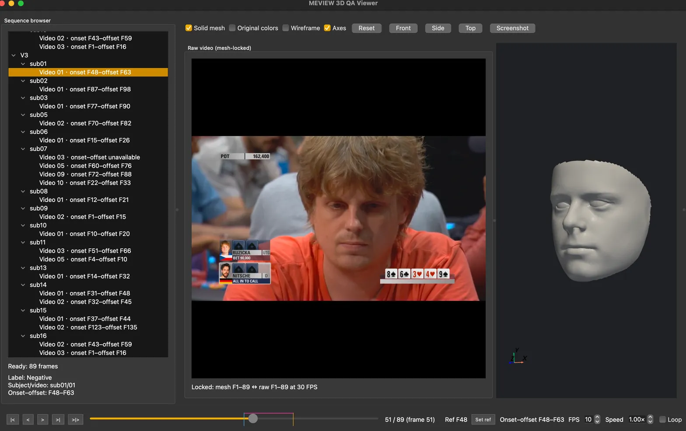

# MEVIEW 3D QA Viewer

Standalone dataset audit and PySide6/PyVista viewer for MEVIEW V2/V3 and
LFANN V3 dense-mesh sequences.

The viewer does not run 3DDFA reconstruction. `*_frontal_vertices.npy`
files provide mesh coordinates, OBJ files provide topology and required per-vertex
color, and illustration JPG files are displayed in the MediaPipe tab. The
`active_frames.json` is external metadata supplied by the caller; its onset
and offset values are inclusive. The teacher's `frontal_meshes_MEVIEW_v3` and
LFANN's `frontal_meshes_LFANN_v3` are separate dataset variants.

Diagnostic displacement, velocity, acceleration, and pooling layers are QA views,
not the Notebook's 3456-dimensional feature vector.

## Interface preview

The screenshot below shows the viewer with the sequence browser, mesh-locked raw
video, 3D mesh viewport, active-frame timeline, and playback controls.



## Usage

This repository runs independently. It has no dependency on a specific host
repository; provide the dataset and metadata paths explicitly. Run the commands
from this repository root. Requires Python 3.12.x and `uv`.

```bash
uv sync
uv run python audit_dataset.py \
  --data-root /path/to/data/dataset \
  --active-frames /path/to/data/active_frames.json \
  --output /tmp/meview-dataset-audit.json
```

`audit_dataset.py` exits with `0` when the dataset is valid, `1` when validation
fails, and `2` for invalid input or configuration. It writes a JSON report with
`summary`, `baseline_errors`, and `sequences` fields. The reference MEVIEW
baseline is 2,009 V2 frames with 38,365 vertices and 2,012 V3 frames with
35,709 vertices.

```bash
uv run python mesh_viewer.py \
  --data-root /path/to/data/dataset \
  --active-frames /path/to/data/active_frames.json \
  --results-dir /path/to/results \
  --landmarks-root /path/to/landmarks
```

Both tools accept `-C`/`--config-file` with a TOML file containing a
`[viewer]` or `[viewer_extract]` section. Direct CLI arguments override the
loaded values:

```bash
uv run python mesh_viewer.py -C ../../config/lfann.toml
uv run --extra landmarks python extract_mediapipe.py -C ../../config/lfann.toml
```

`--results-dir` and `--landmarks-root` are optional. The viewer remains usable
as mesh-only QA when either source is absent. Mesh-only playback remains
available without raw videos; mesh-locked raw-video playback requires the
matching MP4 and `ffprobe` on `PATH`. Use `--self-test` only for the reference
MEVIEW dataset regression check; it expects `v3/sub01/01`, `v2/sub11/03`,
their raw videos, and the expected frame and vertex counts:

```bash
uv run python mesh_viewer.py \
  --data-root /path/to/data/dataset \
  --active-frames /path/to/data/active_frames.json \
  --self-test
```

The dataset must contain the MEVIEW V2/V3 mesh assets expected by the audit
tool. Dataset files, results, raw videos, and release archives are intentionally
not vendored in this repository.
